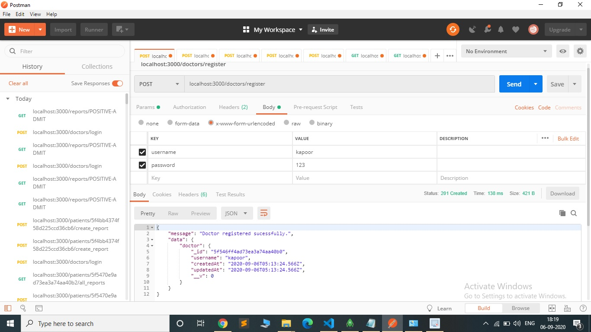
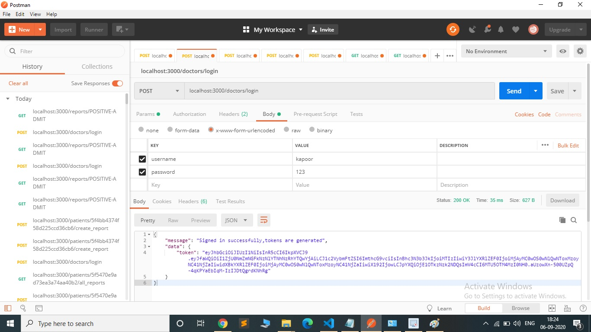
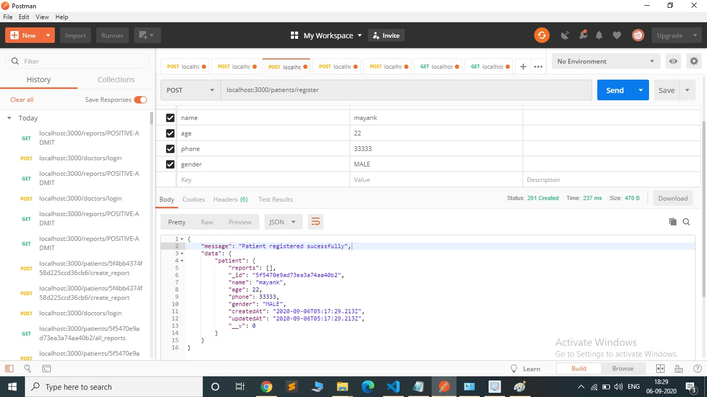
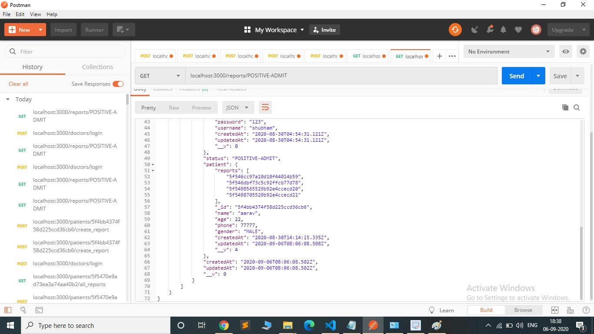

# Hospital-API
This API is for the doctors of a Hospital which has been allocated by the govt for testing and quarantine + well being of COVID-19 patients.

## Application Mechanism
* There can be 2 types of Users
  1. Doctors
  2. Patients
* Doctors can log in.
* Each time a patient visits, the doctor will follow 2 steps
   * Register the patient in the app (using phone number, if the patient already exists, just return the patient info in the API)
   * After the checkup, Doctor create a Report.
   
## Tasks Performs
_It facilitates the doctors in:_ 
* in their authentication(done by JWT).
* patients registration.
* creating patients reports.
* fetching all reports of a particular patient.
* fetching the reports by result status.

## Routes and their responses

1. /doctors/register

2. /doctors/login

* Providing JWT to Authorization key in Header for Authorizing the user.

3. /patients/register

4. /patients/:id/create_report

5. /patients/:id/all_reports

6. /reports/:status 

## Folder Structure

* Assets- It contains css , images and js files.
* Models- Contains 3 models of the project which are Doctor, Patient and Report.
* Controllers- Actions for Doctor,Patient and Report Routes present in controllers/api/v1/
* Routes- Routes Handlers for varoius URLs present in routes/api/v1/.
* Config- Contains Passport-JWT strategy and Mongoose Connection setup.
* index.js- Entry point of application.

## How to setup the Project

* Clone the project.
* Go to correct directory.
* Connect to mongodb.
* npm install the required dependencies.
* Run command: nodemon index.js
* Go to https://localhost/3000
